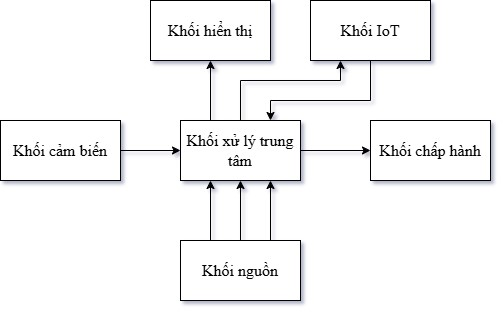
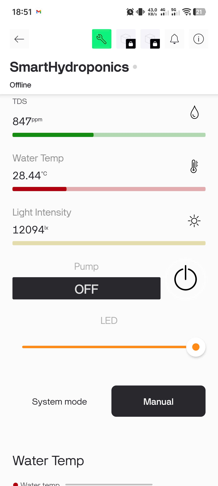
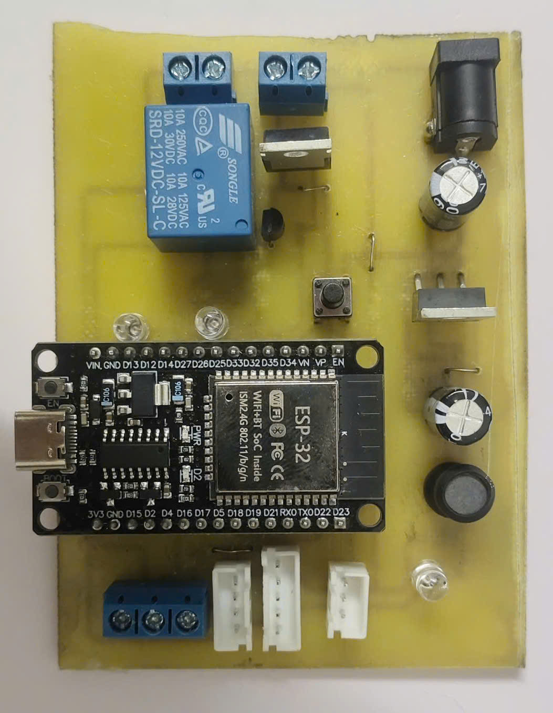
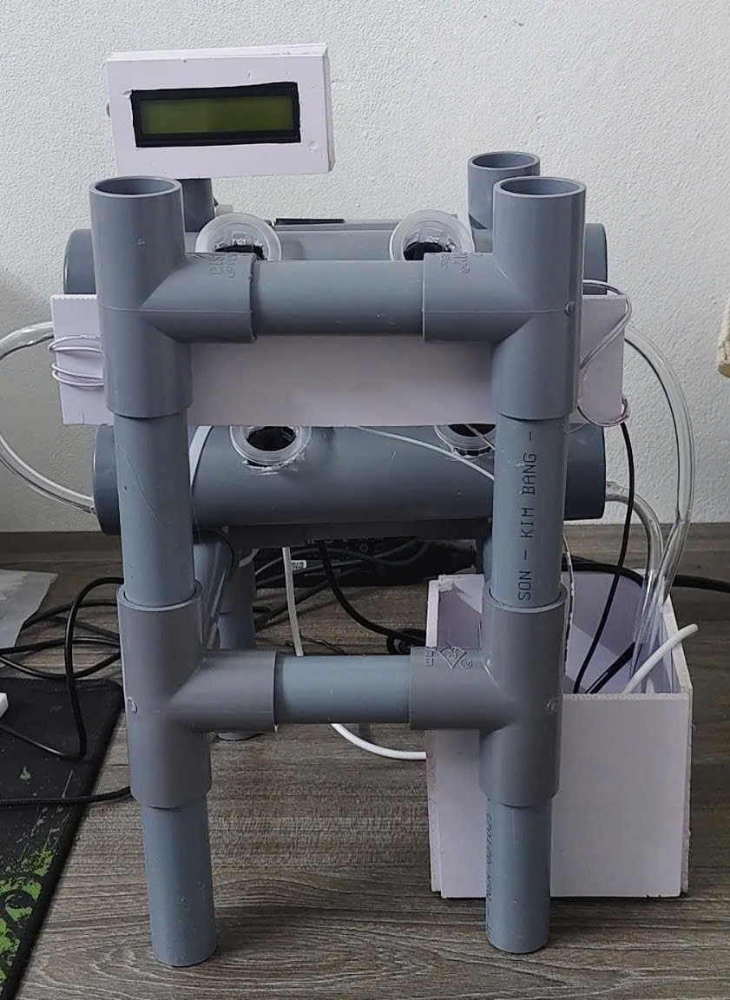

# Design of an IoT Model for Monitoring and Controlling Automated Hydroponics (NFT)

Một hệ thống quản lý, giám sát và điều khiển tự động mô hình trồng rau thủy canh hồi lưu (Nutrient Film Technique - NFT) ứng dụng công nghệ IoT. Dự án này đóng vai trò là Đồ án tốt nghiệp ngành Kỹ thuật Máy tính.

---

## 🚀 Tính năng nổi bật (Key Features)

* **Giám sát thời gian thực:** Thu thập liên tục các chỉ số môi trường dinh dưỡng bao gồm nồng độ chất rắn hòa tan (TDS), độ pH và cường độ ánh sáng.
* **Hiển thị trực quan tại chỗ:** Tích hợp màn hình LCD hiển thị các thông số đo được và đưa ra cảnh báo trực tiếp cho người vận hành.
* **Giám sát & Điều khiển từ xa:** Thiết kế giao diện Dashboard trên ứng dụng di động thông qua nền tảng Blynk IoT để theo dõi hệ thống mọi lúc mọi nơi.
* **Cảnh báo thông minh:** Hệ thống tự động gửi thông báo (App alerts) về điện thoại của người dùng ngay khi các chỉ số vượt ngưỡng an toàn.
* **Tự động hóa hoàn toàn:** Tự động kích hoạt cơ cấu chấp hành (bơm nước thủy canh, đèn LED bù sáng cho cây trồng) dựa trên các ngưỡng sinh trưởng được thiết lập sẵn.

---

## 📐 Sơ đồ khối hệ thống (System Architecture)

## 🛠 Thành phần hệ thống (System Components)
1. Phần cứng (Hardware)
- Vi điều khiển chính: ESP32 DevKit V1
- Cảm biến: Cảm biến đo pH, Cảm biến đo nồng độ TDS, Cảm biến cường độ ánh sáng.
- Cơ cấu chấp hành: Relay, Bơm nước mini, Đèn cob chiếu sáng.
- Hiển thị: Màn hình LCD tích hợp module giao tiếp I2C.
- Thiết kế mạch: Sơ đồ nguyên lý và mạch in PCB được thiết kế hoàn chỉnh trên phần mềm Altium Designer.
2. Phần mềm & Công nghệ (Tech Stack)
- Firmware: C++ (Sử dụng VS Code tích hợp PlatformIO).
- IoT Platform: Blynk Cloud.
- Môi trường phát triển mạch: Altium Designer 24.
📁 Cấu trúc thư mục (Repository Structure)
firmware/: Chứa toàn bộ mã nguồn xử lý trên vi điều khiển ESP32 sử dụng cấu trúc PlatformIO.

hardware/: Chứa các file thiết kế mạch Altium (Sơ đồ nguyên lý .SchDoc, Mạch in Layout .PcbDoc).

docs/: Chứa tài liệu hướng dẫn, hình ảnh thực tế của mô hình thủy canh và giao diện ứng dụng Blynk.

---

## ⚙️ Hướng dẫn cài đặt & Chạy dự án (Installation & Setup)
1. Cấu hình phần cứng
- Kết nối các cảm biến pH, TDS và màn hình LCD I2C vào các chân GPIO tương ứng trên ESP32 theo sơ đồ nguyên lý trong thư mục hardware/.

2. Triển khai phần mềm
- Cài đặt phần mềm VS Code và extension PlatformIO.
- Tải (Clone) kho lưu trữ này về máy tính cá nhân.
- Mở thư mục firmware/ bằng VS Code.
- Tạo một file config.h (hoặc cấu hình trực tiếp trong file mã nguồn) để điền thông tin mạng Wi-Fi và mã Token (Auth Token) từ tài khoản Blynk của bạn.
- Nhấn nút Build và Upload trên PlatformIO để nạp code xuống board mạch ESP32.

---

## 📸 Hình ảnh thực tế & Kết quả (Demo & Results)

|Giao diện app Blynk|Mô hình mạch thực tế|Toàn cảnh hệ thống|
|-------------------|--------------------|------------------|
||||

[Video demo](https://youtu.be/MgMgrIcbNXU) 

---

## 👤 Tác giả (Author)
Nguyễn Trọng Quý - Sinh viên ngành Kỹ thuật Máy tính.

Email: nguyentrongquy132@gmail.com 

Trường/Đơn vị: Đại học công nghiệp Hà Nội